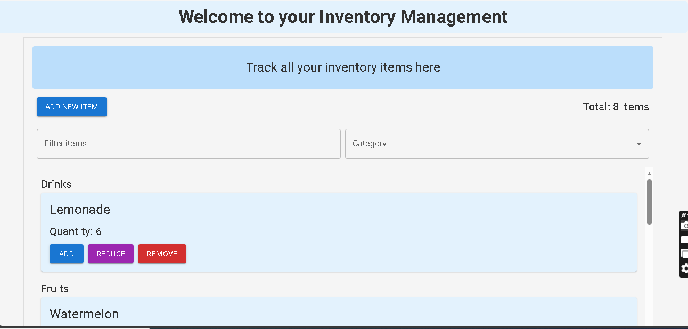

# Inventory Management Application

## Introduction

A simple and efficient web-based tool for managing and tracking inventory items. Easily add, update, filter, and delete items across various categories with a responsive and user-friendly interface.



## Skills Used

- **React**
- **Firebase Firestore**
- **Material-UI**
- **Next.js**

## Features

- Add, update, and delete items
- Filter items by name and category
- Pagination for easy navigation
- Responsive design for mobile and desktop

## Installation

1. **Clone the repository:**
   ```sh
   git clone https://github.com/yourusername/inventory-management.git
   cd inventory-management
   ```
2. **Install dependencies:**
   ```sh
   npm install
   ```
3. **Set up Firebase:**
   - Create a Firebase project and add a web app.
   - Replace the placeholder in `firebase.js` with your Firebase config.
4. **Start the development server:**
   ```sh
   npm run dev
   ```
5. **Open your browser:** Navigate to `http://localhost:3000`.

## Usage

- **Add Items:** Click "Add New Item", fill in details, and save.
- **Update Items:** Use "Add" and "Reduce" buttons to adjust quantities.
- **Delete Items:** Click "Remove" to delete items.
- **Filter Items:** Use the search input and category dropdown.
- **Pagination:** Navigate using "Previous" and "Next" buttons.

